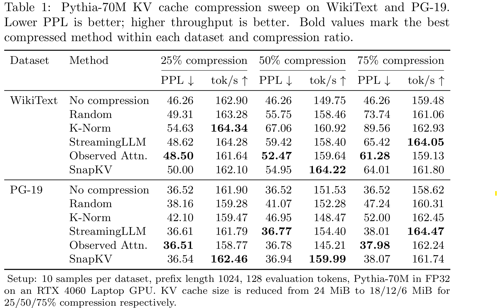

# Pythia-70M KV Cache 压缩复现实验

在 `EleutherAI/pythia-70m` 上复现无训练 KV Cache 压缩方法，并在 WikiText、PG-19 数据集上测试 PPL、decoding 速度和 KV cache 压缩效果。

实验代码位于：

```text
experiments/kvpress_repro/
```

核心脚本：

```text
experiments/kvpress_repro/run_pythia_kvpress_repro.py
```

## 实验目标

本实验完成以下内容：

- 复现 KVPress 中的无训练 KV Cache 压缩方法，所有实验基于 Pythia-70M。
- 在 WikiText 和 PG-19 上测试 PPL。
- 测试压缩后的 decoding 速度变化。
- 统计 KV cache 压缩前后的显存占用变化。

## 复现方法

本实验复现了 5 种 KVPress 风格的无训练压缩方法，并额外提供未压缩 baseline。

| 方法 | 来源思路 | 说明 |
| --- | --- | --- |
| `none` | 未压缩 baseline | 不做 KV cache 压缩，用于主对比。 |
| `random` | `RandomPress` | 随机保留一部分 KV，作为压缩 sanity baseline。 |
| `knorm` | `KnormPress` | 使用 key 的 inverse L2 norm 打分，保留高分 KV。 |
| `streaming_llm` | `StreamingLLMPress` | 保留开头 sink tokens 和最近 tokens，裁剪中间 token。 |
| `observed_attention` | `ObservedAttentionPress` | 使用 prefill 阶段真实 attention 权重平均值衡量 KV 重要性。 |
| `snapkv` | `SnapKVPress` | 使用最近窗口 query 的 attention pattern 估计历史 KV 重要性，并做平滑。 |


## 代码结构

```text
experiments/kvpress_repro/
├── run_pythia_kvpress_repro.py       # 复现实验主脚本
├── README.md                         # 实验目录说明和结果报告
├── data_cache/                       # 固定 token 样本缓存，本地生成，不提交
├── results_gpu/                      # GPU 正式结果，本地生成
├── results_smoke/                    # CPU smoke test 结果
├── results_gpu_smoke/                # GPU smoke test 结果
└── results_cache_build/              # 样本缓存构建检查结果
```

更详细的工作说明见：

```text
docs/todo_test_work_report.md
```

## 环境准备

### 创建或配置 conda 环境


```bash
conda create -n lab python=3.11 -y
```

安装 CUDA 版 PyTorch。

```bash
conda run -n lab pip install torch torchvision torchaudio --index-url https://download.pytorch.org/whl/cu124
```

安装本实验需要的 Python 包：

```bash
conda run -n lab pip install transformers datasets==2.19.2 huggingface_hub pandas numpy tqdm
```

## 下载模型

将 Pythia-70M 下载到本地忽略目录：

```bash
conda run -n lab python -c "import os; os.environ['HF_ENDPOINT']='https://hf-mirror.com'; from huggingface_hub import snapshot_download; snapshot_download(repo_id='EleutherAI/pythia-70m', local_dir='models/pythia-70m', local_dir_use_symlinks=False, resume_download=True)"
```

下载后模型路径为：

```text
models/pythia-70m
```

## 复现实验

完整复现实验命令如下。这个命令会直接运行实验；如果对应参数的 token 缓存不存在，脚本会自动从 WikiText / PG-19 加载文本并生成缓存。

```bash
conda run -n lab python experiments/kvpress_repro/run_pythia_kvpress_repro.py \
  --datasets wikitext,pg19 \
  --max-samples 10 \
  --prefix-len 1024 \
  --eval-tokens 128 \
  --compression-ratio 0.5 \
  --device cuda \
  --dtype float32 \
  --num-threads 4 \
  --output-dir experiments/kvpress_repro/results_large
```

本仓库当前实验还额外扫描了 `0.25` 和 `0.75` 两档压缩率：

### 关于样本缓存

不需要单独先构建缓存。脚本会按参数自动查找：

```text
experiments/kvpress_repro/data_cache/
```

如果缓存存在，直接读取；如果缓存不存在，自动加载数据并生成缓存。只有在希望强制重新抽样或修改了 `--max-samples`、`--prefix-len`、`--eval-tokens` 后需要重建缓存时，才需要添加：

```bash
--refresh-sample-cache
```

## 常用参数

| 参数 | 说明 |
| --- | --- |
| `--model` | 模型路径或 Hugging Face 模型名。 |
| `--datasets` | 要评估的数据集，逗号分隔，例如 `wikitext,pg19`。 |
| `--methods` | 要运行的方法，逗号分隔，例如 `none,random,knorm,streaming_llm,observed_attention,snapkv`。 |
| `--compression-ratio` | 压缩比例，例如 `0.5` 表示裁剪约 50% KV。 |
| `--prefix-len` | 用于 prefill 和压缩的 prefix token 数。 |
| `--eval-tokens` | continuation evaluation token 数。 |
| `--max-samples` | 每个数据集使用的 sample 数。 |
| `--device` | 运行设备，可选 `auto`、`cpu`、`cuda`。 |
| `--dtype` | 模型加载精度，可选 `auto`、`float32`、`float16`、`bfloat16`。 |
| `--output-dir` | 结果输出目录。 |
| `--refresh-sample-cache` | 强制重新构建 token 样本缓存。 |

## 输出文件

实验完成后会输出：

```text
results.csv
results.json
```

例如本文 50% 压缩率实验输出路径：

```text
experiments/kvpress_repro/results_large/results.csv
experiments/kvpress_repro/results_large/results.json
```

CSV 字段包括：

| 字段 | 含义 |
| --- | --- |
| `dataset` | 数据集名称。 |
| `method` | 压缩方法名称。 |
| `compression_ratio` | 压缩比例。 |
| `samples` | 使用的 sample 数。 |
| `prefix_len` | prefix token 数。 |
| `eval_tokens` | continuation evaluation token 数。 |
| `loss_tokens` | 实际计入 loss 的 token 数。 |
| `nll` | 平均 negative log likelihood。 |
| `ppl` | 困惑度，越低越好。 |
| `prefill_s` | prefix prefill 时间。 |
| `compress_s` | KV cache 压缩时间。 |
| `decode_s` | 逐 token evaluation 时间。 |
| `total_s` | `prefill_s + compress_s + decode_s`。 |
| `tokens_per_s` | decoding 阶段吞吐量。 |
| `cache_before_mib` | 压缩前 KV cache 大小。 |
| `cache_after_mib` | 压缩后 KV cache 大小。 |
| `cache_reduction` | KV cache 字节减少比例。 |

## 当前实验结果


